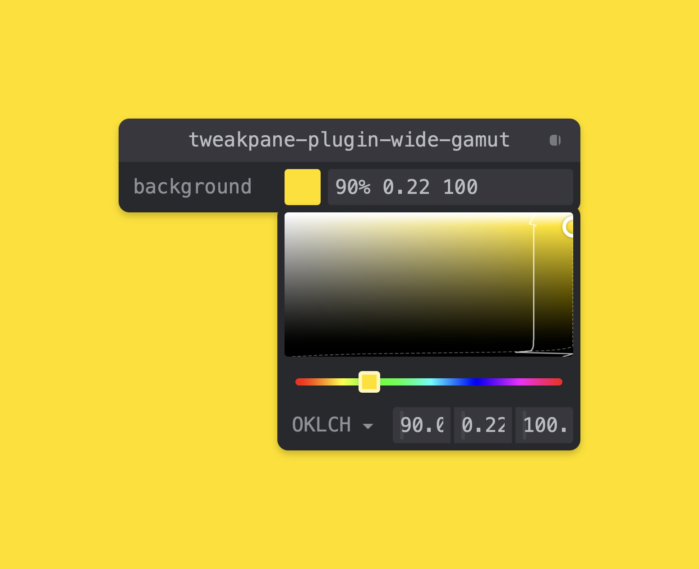

# tweakpane-plugin-wide-gamut

   



A wide-gamut colour picker for [Tweakpane][tweakpane] v4. It mirrors the native
colour picker and adds an **sRGB / P3 gamut boundary** on the OKLCH L×C plane,
plus **11 colour spaces** to read and edit in.
**[Live demo ↗](https://ryankiley.github.io/tweakpane-plugin-wide-gamut/)**

- **Drop-in** — registered once, it claims any colour-string binding; no `view` parameter.
- **11 spaces** — HEX, RGB, CSS, HSL, HWB, OKLCH, OKLab, LCH, Lab, P3, Rec2020.
- **Wide-gamut** — the sRGB/P3 boundary draws on the OKLCH plane; values keep their **source format** and support **alpha**.

## Usage

```sh
npm install tweakpane-plugin-wide-gamut
```

```js
import {Pane} from 'tweakpane';
import * as WideGamutPlugin from 'tweakpane-plugin-wide-gamut';

const pane = new Pane();
pane.registerPlugin(WideGamutPlugin);

pane.addBinding({brand: 'oklch(0.7 0.15 250)'}, 'brand');
```

## Credits

The colour area is adapted from Adam Argyle's [`color-input`][color-input].

[tweakpane]: https://github.com/cocopon/tweakpane/
[color-input]: https://github.com/argyleink/css-color-component
